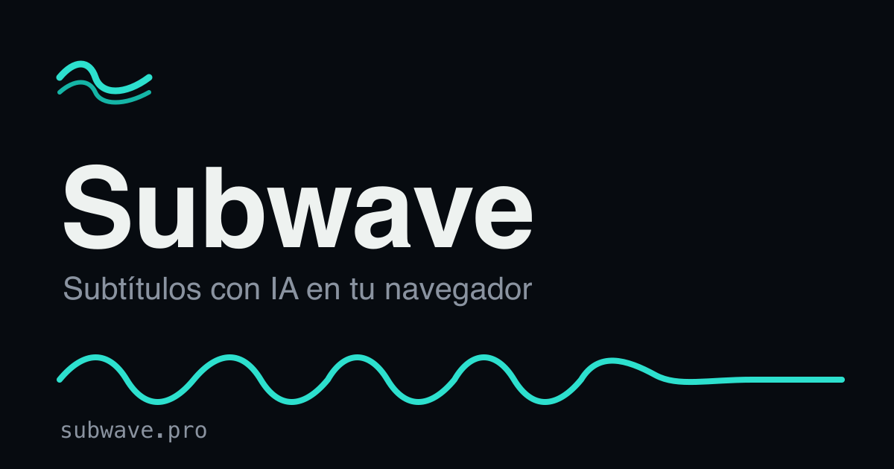

# 🌊 Subwave

**From sound to subtitles — AI captions that never leave your browser.**

[](https://subwave.pro)
[](https://github.com/mroscardev91/subwave/actions/workflows/ci.yml)
[](./LICENSE)
[](https://astro.build)
[](#privacy-is-the-architecture)

### ▶ [Try Subwave live → subwave.pro](https://subwave.pro)



Subwave generates, edits and translates subtitles for any video or audio file **entirely in your browser**. A local Whisper model transcribes the speech, you fine-tune the timing on a timeline, optionally translate locally, and export an `.srt` or a video with burned-in captions.

No backend. No uploads. No API keys. No accounts. Your file never leaves your device — and you can verify it in the Network tab.

> A privacy-first, open-source take on browser subtitling, with its own **wave** identity.

<!-- TODO(portfolio): add a real UI capture of the editor (timeline + waveform +
     styled subtitle) at docs/editor.png and a short upload→transcribe→edit→export
     GIF at docs/demo.gif, then embed them here. The card above is the brand OG. -->

---

## Why Subwave

- 🔒 **Private by architecture.** Everything runs on-device. The only thing that ever downloads is the AI model — once — cached in IndexedDB.
- ⚡ **No servers, no cost to run.** A static site you can host for free on Vercel, Cloudflare Pages, Netlify or GitHub Pages.
- 🎛️ **Real editing.** Segment list + timeline scrubbing, text/timing edits, undo/redo, multi-language tracks, and live subtitle styling.
- 🌍 **Translate locally.** Lightweight OPUS-MT models run in your browser when the subtitle language differs from the spoken one.
- 🎬 **Export anywhere.** Valid `.srt`, or an MP4 with subtitles burned in via WebCodecs (with a canvas + `MediaRecorder` fallback).

## Privacy is the architecture

Subwave has **no backend**. There is nowhere to upload to. The AI models download once from Hugging Face and are cached in your browser; after that, transcription, translation and export all happen on your machine. No analytics, no accounts, no tracking.

The honest test: open DevTools → **Network**, transcribe a clip, and confirm there is **zero** upload of your media.

## How it works

```
Upload  →  Configure  →  Edit  →  Export
```

1. **Upload** — drop a video or audio file (MP4, MOV, WebM, MKV, MP3, WAV, OGG). Read locally with the File API; never sent anywhere.
2. **Configure** — pick the spoken language (or auto-detect) and the subtitle language. Different languages trigger local OPUS-MT translation.
3. **Edit** — adjust text and timings on the timeline, undo/redo, style the captions (font, color, background, outline, position, opacity, size).
4. **Export** — download an `.srt`, or render an MP4 with the subtitles burned in.

Heavy work runs in **Web Workers** so the UI stays smooth: a transcription worker (Whisper), a translation worker (OPUS-MT), and FFmpeg WASM for audio extraction. WebGPU is used when available, with an automatic fallback to WASM.

## Tech stack

| Layer | Tech |
| --- | --- |
| Framework | [Astro 6](https://astro.build) — `output: "static"`, no adapter, no server |
| Styling | [Tailwind CSS 4](https://tailwindcss.com) via `@tailwindcss/vite` — tokens live in `@theme` (see [BRANDING.md](./BRANDING.md)) |
| Language | TypeScript (strict), alias `@` → `./src` |
| ASR | [transformers.js](https://github.com/huggingface/transformers.js) — Whisper |
| Translation | transformers.js — OPUS-MT (Helsinki-NLP) |
| Audio extraction | [`@ffmpeg/ffmpeg`](https://github.com/ffmpegwasm/ffmpeg.wasm) (WASM, single-thread) |
| Video export | [mediabunny](https://mediabunny.dev) + WebCodecs, fallback canvas + `MediaRecorder` |
| i18n | Astro native — `en` (default, `/`) + `es` (`/es/`) |

## Getting started

Requires **Node ≥ 22.12** and **pnpm**.

```sh
pnpm install
pnpm dev        # http://localhost:4321
pnpm build      # static output → ./dist
pnpm preview    # preview the build
```

Deploy: import the repo on [Vercel](https://vercel.com) (it detects Astro automatically) — the same static build also works on Cloudflare Pages, Netlify and GitHub Pages. Then set your final URL in `astro.config.mjs` (`site:`) so canonical/hreflang/OG/sitemap are correct.

## Project structure

```
src/
├── components/   Home, App shell + Upload/Config/Editor stages, Footer
├── i18n/         locales.ts (Lang, defaultLang) · ui.ts (en/es strings)
├── layouts/      Layout.astro (head, hreflang, OG, fonts, runtime i18n)
├── pages/        index.astro (en) · es/index.astro (es)
├── scripts/      app.ts, stageManager.ts (+ stages, workers, media, export)
└── styles/       global.css (the @theme design tokens)
```

The app is a multi-stage SPA embedded in a static page: the landing (paper mode) and the editor (deep-water mode) coexist in one document, and `stageManager.ts` swaps between them client-side.

## Roadmap

Built milestone by milestone (see [PROMPT.md](./PROMPT.md)):

- [x] **1 — Scaffold:** static Astro + Tailwind v4 + TS + i18n + branded landing
- [x] **2 — Stages + navigation:** the three stages mount and `stageManager` toggles them
- [x] **3 — Upload + audio extraction** (FFmpeg WASM in a worker, with progress)
- [x] **4 — ASR in a worker** (Whisper download + IndexedDB cache, WebGPU→WASM)
- [x] **5 — Editor + timeline + undo/redo + subtitle styles**
- [x] **6 — Local translation** when the output language differs
- [x] **7 — Export** `.srt` and burned-in MP4 (mediabunny + fallback)
- [x] **8 — Full en/es i18n, SEO/OG/hreflang, sitemap, client-side locale redirect**
- [x] **9 — Polish:** accessibility, error states, model-cache management, hero wave animation

## Brand

Subwave = **sub**(title) + **wave** (the audio waveform). The logo is a wave with a fainter sub-wave beneath it; the single accent is an electric aqua (`#2DE0CE`) on a deep-water editor. Full identity and the exact design tokens are in [BRANDING.md](./BRANDING.md).

## Built with AI, in the open

This project is being built with [Claude Code](https://claude.com/claude-code) following the master prompt in [PROMPT.md](./PROMPT.md), with project context in [CLAUDE.md](./CLAUDE.md) and area-specific knowledge in [`.claude/skills/`](./.claude/skills). It's published openly, process and all.

## License

[MIT](./LICENSE) © mroscardev

---

🇪🇸 ¿Español? La guía completa para montar y desplegar Subwave está en **[LEEME.md](./LEEME.md)**.
